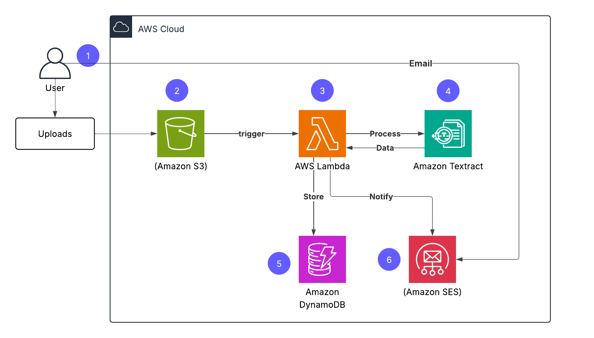

# 🧾 AWS Receipt Processing System

An automated serverless system that processes receipts using AWS services and AI.

## 🚀 Overview

This project allows users to upload receipt images, automatically extracts relevant data, stores it, and sends a summary via email.

## 🏗️ Architecture

## ⚙️ Services Used

- Amazon S3 → Store uploaded receipts
- AWS Lambda → Process receipts
- Amazon Textract → Extract receipt data
- Amazon DynamoDB → Store structured data
- Amazon SES → Send email notifications

## 🔄 Workflow

1. User uploads receipt to S3
2. S3 triggers Lambda
3. Lambda calls Textract to extract data
4. Data is stored in DynamoDB
5. Email summary is sent via SES

## 🧠 Features

- Fully serverless
- Event-driven architecture
- Automated data extraction using AI
- Email notifications
- Scalable & cost-efficient

## 🛠️ Setup Guide

Check `docs/setup-guide.md`

## 📂 Project Structure
